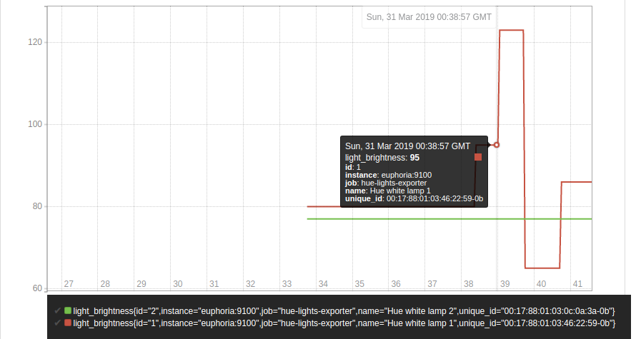

# hue-lights-exporter



A Prometheus exporter for the Philips Hue Bridge Lights, written in Go.

## Instalation

### From binaries

`hue-lights-exporter` requires Go 1.11+.

```
go get github.com/ramaro/hue-lights-exporter
```

## Usage
```
$ hue-lights-exporter -help
Usage of ./hue-lights-exporter:
  -bridge-url string
        url of the Hue bridge device (default "http://philips-hue")
  -listen-address string
        set HTTP listen address (default ":9100")
  -metrics-path string
        set metrics path (default "/metrics")
  -username string
        set authorised API username
```


## Running
```
$ hue-lights-exporter -username VBYPKZXBqwcLCSdzj5yLW1gjK2fb9XCOSxQ1dP7B
```

### Metrics

|Name               |Type   |Help
|----               |----   |----
| light_status      | gauge | Status of light (on/off) [name, id, unique_id]
| light_brightness  | gauge | Brightness of light [name, id, unique_id]
| light_hue         | gauge | Hue of light [name, id, unique_id]
| light_saturation  | gauge | Saturation of light [name, id, unique_id]
| light_reachable   | gauge | Reachability of light [name, id, unique_id]
| up                | gauge | Was the last scrape successful?

## Creating an authorised Hue Bridge API username (example)

Register with curl command:
```
$ curl -X POST -d '{"devicetype":"my app name#my_username"}' http://philips-hue/api
[{"error":{"type":101,"address":"","description":"link button not pressed"}}]
```

Then press hue bridge link button and run curl again:
```
$ curl -X POST -d '{"devicetype":"my app name#my_username"}' http://philips-hue/api
[{"success":{"username":"VBYPKZXBqwcLCSdzj5yLW1gjK2fb9XCOSxQ1dP7B"}}]
```

Username is: VBYPKZXBqwcLCSdzj5yLW1gjK2fb9XCOSxQ1dP7B


## Contributing

Bug reports and features are welcome!
